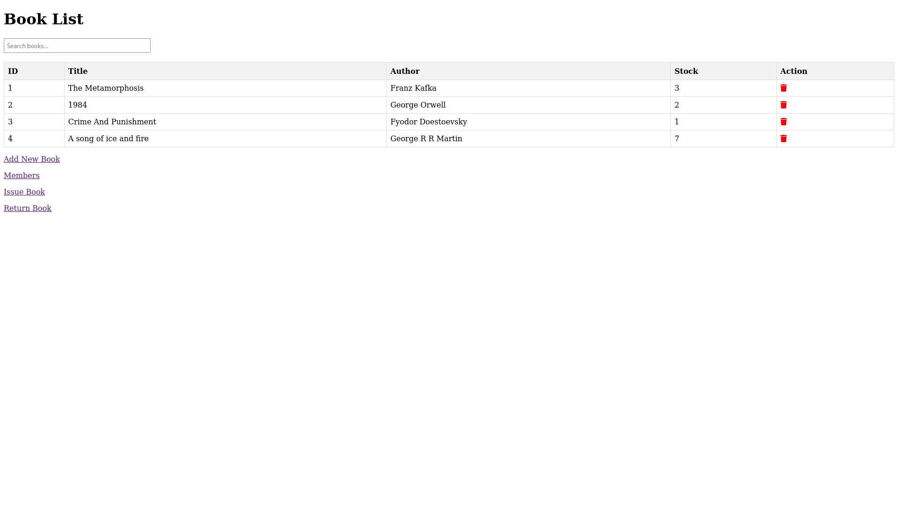
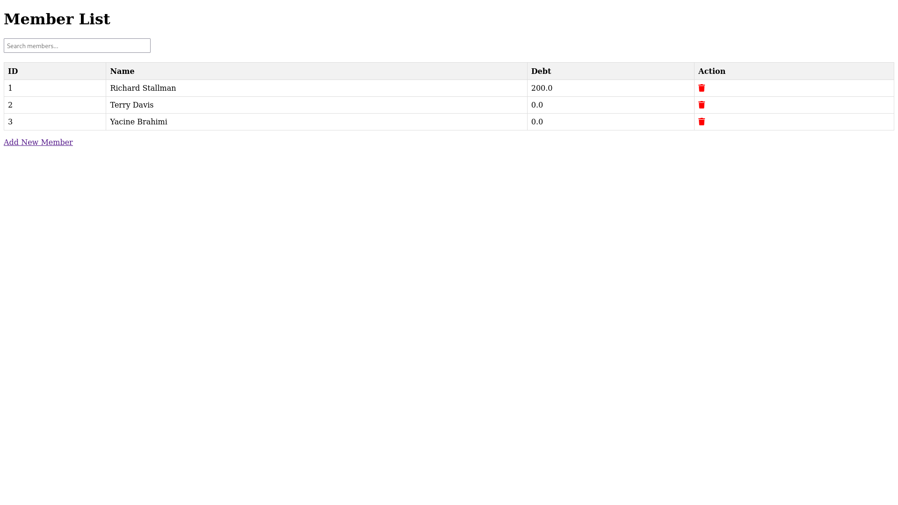

# Library Management System

A simple library management system built with Django, designed to help manage books, members, and transactions in a small library.

Features
-  Manage books: Add, update, and delete books in the library.
-  Manage members: Add, update, and delete library members.
-  Manage transactions: Issue and return books, and track transaction history.
-  User authentication: Admin login to manage the library system.
-  Simple and intuitive web interface.






## Installation

Clone the repository:


```
git clone https://github.com/Jaarabytes/library-crud.git
```		

Create a virtual environment (optional but recommended):


```
python -m venv venv
source venv/bin/activate  # For Unix/Linux
venv\Scripts\activate  # For Windows
```		

Install the required packages:

```
pip install -r requirements.txt
```		

Apply database migrations:


```
python manage.py migrate
```		

Create a superuser for admin access:

```
python manage.py createsuperuser
```


Run the development server:

```
python manage.py runserver
```		

Access the library management system in your web browser at <http://localhost:8000>.


## Usage

To access the admin interface, log in with the superuser credentials created during installation at <http://localhost:8000/admin>.

Add, update, and delete books, members, and transactions through the admin interface or the main web interface.

Issue and return books to members and track transaction history.


## Contributing

Contributions to the library management system are welcome! To contribute, please follow these steps:

- Fork the repository.
- Create a new branch for your feature or bug fix.
- Make your changes and commit them with descriptive messages.
- Push your changes to your forked repository.
- Submit a pull request detailing your changes.

## License

This library management system is open-source and available under the MIT License.
